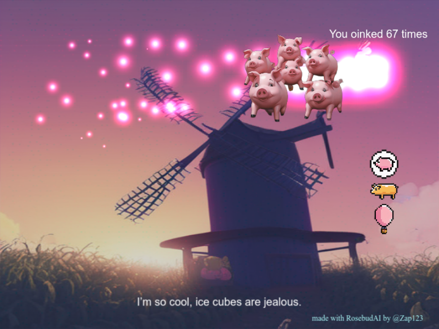

# 🐷 Oink! A pig clicker game

This is a game made to test [RosebudAI](https://www.rosebud.ai/) an AI powered game development IDE as I'm a beta tester of the product. 

I just wanted to see how far you could go and create something new and unique. I started with the PhaserJS template and asked the editor to replace the main object with a pig and then one thing came after another.

There are 3 different power-ups:
- bubble pig: slow down the pig speed for 10 seconds
- gold pig: increase the coin rate by 5
- balloon pig: put a balloon on the screen that when popped give you 5 oink points

Power-ups are purchased by clicking on the icons with coins that are earned every 10 clicks. Since rosebud AI doesn't allow you to create sounds, I used the TTS for the clicking sound.

There are 2 unlockable backgrounds at 100 and 200 clicks and funny pig quotes generated by the AI at every click!

The scope of the game is to click on pigs as many times as possible, no ending condition.

[Play The game](https://play.rosebud.ai/games/ffdd84af-03e7-4595-aacc-c3b7decba309)
